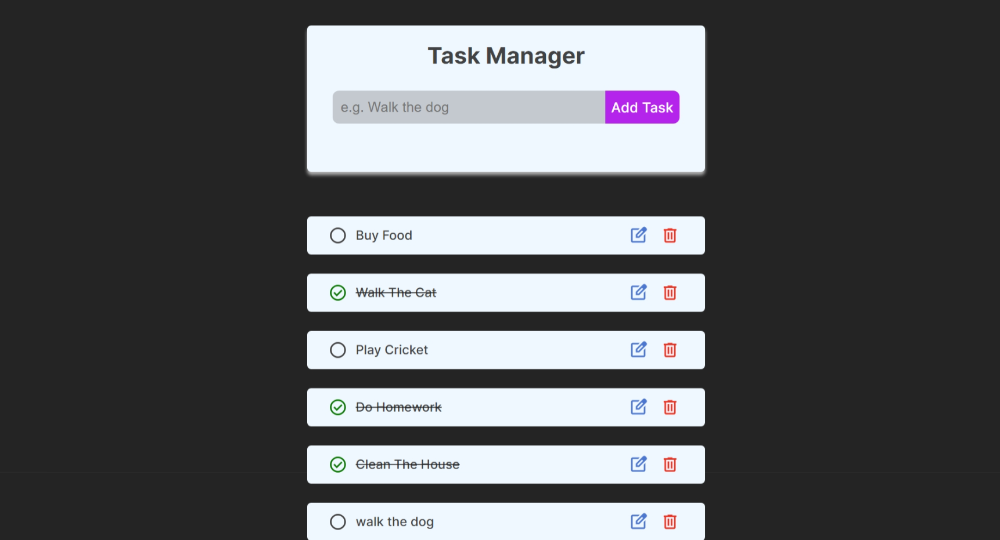
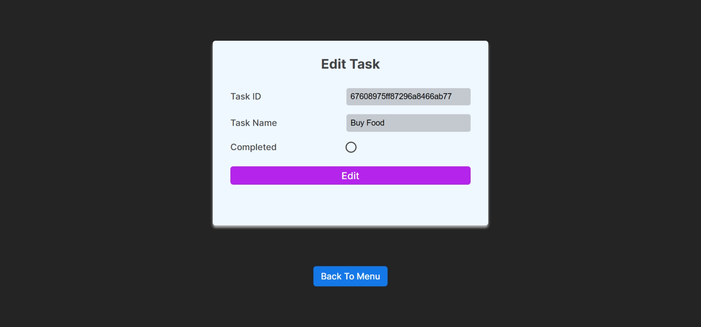

# Task Manager 📝

A simple and interactive Task Manager web application built with the **MERN stack** (MongoDB, Express, React, Node.js). I've implemented the basic CRUD operations to manage tasks effectively. This project serves as a great starting point for understanding full-stack development and building RESTful APIs. As this is my first MERN Stack project, the code will be full of comments.

---

## 🚀 Features

- Add, edit, complete, and delete tasks
- Persistent storage using MongoDB
- RESTful API with Express.js
- Modern React frontend with routing (`react-router-dom`)
- Responsive and user-friendly UI
- Real-time feedback for actions (success/error messages)
- Clean project structure with separation of concerns

---

## 🗂️ Project Structure

```plaintext
task_manager/
├── client/
│   ├── package.json
│   └── src/
│       ├── App.jsx
│       └── components/
│           ├── Main_menu.jsx
│           └── Edit_menu.jsx
├── server/
│   ├── package.json
│   ├── index.js
│   ├── controller/
│   │   └── tasks.js
│   ├── models/
│   │   └── Tasks.js
│   ├── routes/
│   │   └── tasks.js
│   ├── db/
│   │   └── connect.js
│   └── middleware/
│       ├── errorHandler.js
│       ├── pageNotFound.js
│       └── customAPIError.js
├── package.json
└── README.md
```


---

## 🖥️ How to Run

### 1. Clone the repository

```bash
git clone <repo-url>
cd task_manager
```

### 2. Backend Setup

```bash
cd server
npm install
npm run dev
```

- The backend runs on [http://localhost:8000](http://localhost:8000) by default.
- Make sure to create a `.env` file in the `server` directory with:
  ```
  MONGO_URI=<your-mongodb-connection-string>
  ```

### 3. Frontend Setup

Open a new terminal and run:

```bash
cd client
npm install
npm run dev
```

- The frontend runs on [http://localhost:5173](http://localhost:5173) by default.

### 4. All-in-one Start (optional)

From the root directory, you can use:

```bash
npm run install:all
npm start
```

This will concurrently start both client and server if you have `concurrently` installed (see root `package.json`).

---

## :camera: Screenshots



---

## 📦 Environment Variables

- In `server/.env`:
  ```
  MONGO_URI=<your-mongodb-connection-string>
  ```

---

## 📄 License

No License
